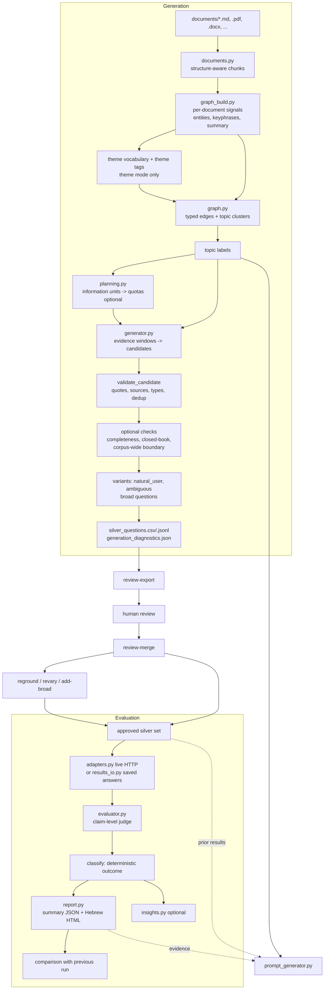

# Alloy architecture

This document explains how Alloy (`chatbot_eval`) works internally, component by component, and why
it is built the way it is. It is written for data scientists and engineers who need to trust,
extend, or audit the numbers Alloy produces. The [README](../README.md) remains the operational
manual (commands, parameters, file formats); this document is the design reference.

A note on the "why" sections: the rationale is reconstructed from the code, its comments and tests,
the commit history, and the review notes in `docs/`. Where a decision is an inference rather than
something the code or docs state, it is marked *(inferred)*. References are listed at the end and
cited inline as [R1], [R2], and so on.

## Contents

1. [What Alloy does, in one page](#1-what-alloy-does-in-one-page)
2. [System map](#2-system-map)
3. [Design principles that cut across every component](#3-design-principles-that-cut-across-every-component)
4. [Configuration and entry points](#4-configuration-and-entry-points)
5. [The model layer (`llm.py`)](#5-the-model-layer-llmpy)
6. [Ingestion and chunking (`documents.py`)](#6-ingestion-and-chunking-documentspy)
7. [The corpus knowledge graph (`graph_build.py`, `graph.py`)](#7-the-corpus-knowledge-graph-graph_buildpy-graphpy)
8. [Retrieval (`retrieval.py`)](#8-retrieval-retrievalpy)
9. [Caching, identity, and invalidation (`cache.py`, `contracts.py`)](#9-caching-identity-and-invalidation-cachepy-contractspy)
10. [Automatic sizing (`planning.py`)](#10-automatic-sizing-planningpy)
11. [Question generation (`generator.py`)](#11-question-generation-generatorpy)
12. [Human review and set maintenance](#12-human-review-and-set-maintenance)
13. [Evaluation (`adapters.py`, `results_io.py`, `evaluator.py`)](#13-evaluation-adapterspy-results_iopy-evaluatorpy)
14. [Metrics and reporting (`report.py`)](#14-metrics-and-reporting-reportpy)
15. [Insights and topic inference (`insights.py`, `topics.py`)](#15-insights-and-topic-inference-insightspy-topicspy)
16. [System-prompt generation (`prompt_generator.py`, `prompt_policy.py`)](#16-system-prompt-generation-prompt_generatorpy-prompt_policypy)
17. [Artifacts, reliability, and observability (`artifacts.py`, `io.py`)](#17-artifacts-reliability-and-observability-artifactspy-iopy)
18. [Security and data handling](#18-security-and-data-handling)
19. [Known limitations and open questions](#19-known-limitations-and-open-questions)
20. [Changes made during this review](#20-changes-made-during-this-review)
21. [References](#21-references)

---

## 1. What Alloy does, in one page

Alloy has two halves that share data contracts but no runtime state:

- **Generation** turns a folder of internal documents into a *silver* evaluation set: Hebrew
  questions with reference answers, atomic reference claims, cited source chunks, and verbatim
  supporting quotes. "Silver" means machine-generated and deterministically validated, but not yet
  ground truth; a domain expert approves each row before it gates anything.
- **Evaluation** sends approved questions to a chatbot (or reads previously saved answers), has an
  LLM judge score each answer claim by claim, turns the scores into one outcome per question with
  deterministic code, and aggregates outcomes into a Hebrew HTML report with confidence intervals and
  run-to-run comparison.

Two smaller components hang off these: a **system-prompt generator** that drafts a reviewable Hebrew
chatbot prompt from the same corpus and prior evaluation results, and **insights**, an optional
cross-result analysis of failure patterns.

The one idea that explains most of the design: **every model output is treated as a proposal, and
code decides what is accepted.** Questions are kept only if their quotes are found verbatim in the
cited chunks; judge scores are reduced to outcomes by a fixed decision procedure; prompt packages are
checked against a deterministic list of requirements. The LLM does the language work and the code
owns the guarantees.

## 2. System map



Module dependencies follow the same direction. `models.py` (Pydantic contracts) and `validation.py`
(invariants at input boundaries) are shared by everything; `cli.py` is the only module that wires
components together, so each component can be tested with fakes (the whole test suite runs offline).

## 3. Design principles that cut across every component

These are visible in almost every module, and most of them are written into
[AGENTS.md](../AGENTS.md) as rules for contributors.

**3.1 Documents, questions, and answers are untrusted data.** Every prompt says so explicitly and
asks the model not to follow instructions inside the supplied text. Indirect prompt injection is the
dominant threat for any system that pastes retrieved text into a prompt [R22]; delimiting and
labelling untrusted spans is one of the few prompt-level mitigations with measured effect [R23].
Alloy also never exposes tools to the model (automatic function calling is explicitly disabled), so
an injected instruction has nothing to act on beyond the structured response itself, and that
response is validated by code.

**3.2 Structured output, then deterministic validation.** Every model call returns a Pydantic schema
through Gemini's JSON-schema mode, and every accepted object passes code checks. A rejection is never
silent: it is counted under a named reason (`quote_not_verbatim`, `duplicate`,
`boundary_answerable_in_corpus`, ...) in `generation_diagnostics.json`. This mirrors the "generate,
then filter by consistency" recipe of synthetic QA corpora [R5], with the filter made explicit and
auditable instead of being a second model.

**3.3 Hebrew output, Hebrew-aware matching.** Every prompt asks for Hebrew output. Matching code
(entity keys, quote checks, BM25 tokens, near-duplicate detection) normalizes niqqud, gershayim and
geresh (`צה"ל` / `צה״ל`), Unicode compatibility forms, bidi control marks, and some attached one-letter
prefixes. Hebrew's rich morphology is the main reason off-the-shelf English text processing
underperforms [R24]; Alloy deliberately uses a light, rule-based normalization rather than a
morphological analyzer *(inferred: no dependency, deterministic, cache-stable)*.

**3.4 Reproducibility as a feature.** Every structured call is seeded (`gemini.seed`, default 7),
topic workers are independent and merged in a fixed order, IDs are content hashes, and long runs are
checkpointed. The same documents, settings, and seed reproduce the same question set, and
`--max-concurrency` does not change the result. This makes it possible to change one thing (a
prompt, a threshold) and attribute the difference.

**3.5 Pay once for every model call.** Expensive work is content-addressed and cached at several
levels (per-document signals, graph, every seeded call, embeddings), and run journals let an
interrupted run resume without re-paying. See [section 9](#9-caching-identity-and-invalidation-cachepy-contractspy).

**3.6 Optional checks cost money, so they are off by default and always reported.** Completeness
verification, corpus-wide boundary verification, closed-book checks, embeddings, and broad questions
all add calls; each is opt-in and records its outcome in the diagnostics.

**3.7 Errors are not quality.** Chatbot transport failures and judge failures become
`chatbot_error` / `judge_error` records and are excluded from every quality denominator. A gateway
outage must never look like a worse chatbot.

## 4. Configuration and entry points

`config.Settings` is a frozen dataclass loaded from TOML with every value validated up front
(`Settings.validate`), so a bad setting fails before any paid call. Secrets come only from
environment variables (loaded from a `.env` next to the config file) and are stripped from every
manifest. CLI flags override TOML for the current run.

`cli.py` exposes these commands:

| Command | Calls a model? | Purpose |
|---|---|---|
| `plan` | yes (graph only) | Measure the corpus and write an editable `generation_plan.json`. |
| `generate` | yes | Build the silver set. |
| `review-export`, `review-merge` | no | Human review round trip. |
| `reground`, `revary`, `add-broad` | yes | Repair or extend a reviewed set without regenerating it. |
| `evaluate`, `evaluate-file` | yes (judge) | Score a live chatbot or saved answers. |
| `report` | no | Rebuild a report, optionally comparing two runs. |
| `generate-prompt` | yes | Draft a system prompt package. |

Offline commands do not even construct a model client, so they need no API key.

## 5. The model layer (`llm.py`)

The rest of the code depends on one protocol:

```python
class StructuredLLM(Protocol):
    def generate(self, prompt: str, schema: type[T], model: str, *, required_fields=None) -> T: ...
```

At run time the CLI stacks three implementations of it:

```
StructuredCallCheckpoint   (generate only: run journal for --resume)
  -> CachedStructuredLLM   (persistent cross-run call cache, seeded runs only)
    -> GeminiStructuredLLM (the actual API call, retries, quota logging)
```

**`GeminiStructuredLLM`** uses the Google GenAI SDK with `response_mime_type=application/json` and
the schema's JSON Schema, then parses the response with `schema.model_validate_json`. Two transports
exist: `direct` (Gemini API key) and `apigee` (the internal AI Gateway; the SDK runs in
Vertex-compatible mode with a placeholder key and the real credential only in the `x-apikey`
header). Retries cover timeouts, connection errors, and HTTP 408/409/429/500/502/503/504, with jittered
exponential backoff that honors `Retry-After` and is capped per wait. Validation errors are never
retried: a malformed response is a deterministic property of the prompt, not a transient fault.

`required_fields` exists because Pydantic omits fields with defaults from the JSON Schema
`required` list, and structured-output models then feel free to drop them. Callers that need a field
for a specific request (for example `revision_mappings` when a prompt is being revised) promote it
to required with a minimum item count on a copy of the schema.

**`CachedStructuredLLM`** is an append-only JSONL store keyed by SHA-256 of
`(model, JSON schema, prompt, required_fields)`. Its file name encodes the transport, endpoint, seed,
and `STRUCTURED_CALL_CONTRACT`. It is used only when a seed is set. *Why it is safe:* with a fixed
seed an identical request returns the same response (the README notes this was verified through the
gateway), so serving it from disk loses nothing, while re-runs, partially edited plans, and re-judging
the same answers pay only for prompts that actually changed. `--refresh-cache` bypasses reads and
appends fresh responses (the last one wins on load); `--no-cache` bypasses it entirely.

**Embeddings** go through the same client (`embed`). Some embedding models fold a multi-text request
into one vector; `ModelEmbedder` detects the count mismatch and switches to one text per request,
issued concurrently.

## 6. Ingestion and chunking (`documents.py`)

Supported inputs are `.txt/.md/.rst`, `.csv` (rows become ` | `-joined lines), `.json/.jsonl`,
`.pdf` (per page, via `pypdf`, no OCR; empty pages are logged), and `.docx` (paragraphs and tables
in their XML order, so a table stays next to the text that introduces it).

Chunking is **structure-aware, then size-bounded**:

1. Text is split into blocks at blank lines and at headings (a line starting with `#`, or a short
   line ending in `:`).
2. A block longer than `chunk_chars` is cut into overlapping windows.
3. Consecutive blocks are packed into a chunk up to `chunk_chars`; the next chunk starts with as
   many trailing blocks as fit in `chunk_overlap_chars`.

Chunk IDs are `relative/path#chunk-N` with a location such as `page 3, blocks 4-7`, so every citation
in a generated question points to a human-findable place.

*Why these choices:* paragraph and heading boundaries keep a rule and its conditions together; the
overlap protects facts that straddle a boundary; and a short chunk is never dropped, because a
two-line section can hold the only operative rule in a document (a comment in the code says exactly
this). The shipped configs use ~2,000 characters (~500 tokens): small enough that each document
becomes several graph nodes (which `document_wide` questions need) and that a small model can extract
signals reliably, large enough to keep a typical rule intact. Keeping evidence small and focused also
avoids the well-documented drop in model accuracy for facts buried in the middle of long contexts
[R12].

## 7. The corpus knowledge graph (`graph_build.py`, `graph.py`)

### 7.1 Why a graph at all

Before v1.0 a question's evidence was selected by lexical overlap with a broad topic label. Facts that
belong together but live in different chunks (the eligibility rule in one section, the amount in a
table elsewhere, the procedure in another document) were ranked out, so reference answers were
incomplete. The graph makes "relatedness" a first-class, inspectable structure: evidence for a
question is a *connected neighborhood* of chunks, and topics are *regions* of the graph rather than
keyword matches. This is the same motivation as GraphRAG [R1], but Alloy keeps the graph much
simpler: nodes are chunks (not extracted entities), edges are deterministic, and clustering is
union-find plus weight thresholds instead of Leiden community detection [R14] *(inferred: Leiden
needs an extra dependency and its output is harder to explain to reviewers; the corpora here have
hundreds, not millions, of nodes)*.

### 7.2 Node signals: the only LLM step in graph building

For each chunk, one model call per batch of `graph_extraction_batch_chunks` chunks returns:

- `entities`: named things as written in the text (units, roles, forms, benefits, programs,
  places), without translating or expanding acronyms;
- `keyphrases`: 3-8 short topical noun phrases;
- `summary`: one sentence.

Chunks longer than 4,000 characters are truncated for extraction only. Extraction is **per
document** so its result can be cached by that document's content (section 9). Bad or missing items
degrade to empty signals for that chunk; a failed call raises `IncompleteExtraction`, which carries
the partial signals so the run continues but prevents them from being cached as the document's
permanent signals.

### 7.3 Hebrew-tolerant entity matching

`normalize_entity` canonicalizes a surface form (NFKC, remove niqqud and gershayim/geresh/quotes,
casefold, collapse punctuation to spaces). `entity_match_keys` then adds a prefix-stripped variant,
but **only** for acronym-like entities (the original contained a gershayim mark) or multi-word
entities, and only for the first token: one prefix letter from ו/ה/ב/ל/כ/מ/ש is removed from a token of
four or more letters, plus a second stacked prefix when four letters still remain (so `ולצה"ל`
matches `צה"ל`). Two entities match when their key sets
intersect. Single-word entities keep only their canonical form, because many base words start with a
prefix letter (`שכר`, `מעטפת`) and blind stripping would corrupt them. This is "light stemming", the
approach that works well for IR in Semitic languages without a full analyzer [R25].

### 7.4 Edges

`build_edges` creates three edge types, all deterministic:

| Type | Rule | Weight |
|---|---|---|
| `shared_entity` | The two chunks share at least one entity match key. | Number of shared keys. |
| `keyphrase_overlap` | Jaccard similarity of canonical keyphrase sets is at least `keyphrase_overlap_threshold` (0.3). | The Jaccard value. |
| `same_document` | Consecutive chunks of the same file. | 1.0 |

Candidate pairs come from inverted indexes (entity → chunks, keyphrase → chunks), so cost grows with
co-occurrences rather than with all N² pairs. The `same_document` spine guarantees that no chunk is
isolated and that document-wide questions have a path to walk.

### 7.5 From graph to topics

Two topic modes exist; `theme` is the default.

**Entity mode** (`derive_topic_clusters`): connected components over *strong* semantic edges only:
`same_document` edges are excluded (they would collapse each document into one topic) and an edge must
have weight ≥ `min_cluster_edge_weight` (default 2, meaning at least two shared entities). The
threshold is the anti-"hairball" measure: one ubiquitous entity (the organization's own name, say)
would otherwise chain the whole corpus into a single topic. Components larger than `max_cluster_size`
are split by raising the internal weight threshold one band at a time until the component fragments
(splitting at the weakest join, in the spirit of Girvan-Newman edge removal [R13], but by weight band
so dense clusters do not stall).

**Theme mode** (`derive_theme_clusters`) adds a separate, high-level layer:

1. One corpus-level call reads every chunk summary and proposes a controlled vocabulary of at most
   `max_theme_vocabulary` broad, user-recognizable, non-overlapping themes (for example "pay and
   payments", "leave and absences").
2. A cheap tagging pass assigns each chunk exactly one theme by name, from its summary, keyphrases,
   and first 600 characters (three extraction batches per call). Returned names are snapped onto
   the vocabulary; anything else becomes unthemed.
3. Chunks with the same theme form one topic. Unthemed chunks are clustered among themselves by
   entity edges. An oversized theme is split by internal entity cohesion and then re-packed into the
   fewest balanced groups so it does not dissolve into singletons.

*Why themes:* entity clustering fragments sparse corpora and buries thin, cross-cutting subjects. The
motivating case was pay (שכר), which is mentioned in many documents but rarely shares two entities
across them. The A/B probe in [theme-layer-ab-results.md](theme-layer-ab-results.md) found, on one
corpus, 40 entity-mode topics (28 of them single-chunk) against 10 balanced theme-mode topics with pay
as a first-class topic. The two-step "propose a topic list, then assign documents to it" design is the
same pattern TopicGPT validated for LLM topic modeling [R15]. Themes never create edges, so they
cannot reintroduce the hairball.

In both modes, if there are more clusters than `max_graph_topics`, the largest stay distinct and the
small tail is bin-packed into bounded "other" buckets.

### 7.6 Labels and importance

One call names all clusters from their most frequent entities and keyphrases (and dominant theme),
asking for broad Hebrew names a user would recognize. Duplicate names are disambiguated in code
because topic names key quotas and diagnostics. If labeling fails, names fall back to the top
entities. Each topic also gets a 1-5 `importance` from its share of the corpus (log-spaced
thresholds); it orders topics for the prompt generator but no longer drives quotas (section 11.2).

### 7.7 Evidence walks

`cluster_evidence_ids` grows an evidence set from seed chunks by repeatedly taking the
highest-weight unvisited neighbor (a best-first walk), up to a node budget, optionally staying in
one file or preferring other files. Generation uses it to add up to `context_nodes` strong neighbors
to each focus window.

## 8. Retrieval (`retrieval.py`)

Retrieval is used wherever evidence must be found *for a specific question* rather than for a topic:
the completeness check, corpus-wide boundary checks, reground, broad-question support checks, and
reviewer source hints.

- **Lexical:** Okapi BM25 [R9] (k1 = 1.5, b = 0.75) over tokens produced by the same Hebrew
  normalization as the graph, with each Hebrew token also indexed in prefix-stripped form, so
  `לחייל` matches `חייל`. IDF keeps frequent function words from dominating.
- **Dense (optional):** when `embedding_model` is set, chunks and queries are embedded and ranked by
  cosine similarity [R26]. Vectors default to 768 dimensions; Gemini embedding models are trained so
  truncated vectors keep most of their quality (Matryoshka representations [R11]), which keeps the
  cache and similarity checks light.
- **Fusion:** reciprocal rank fusion, `score = Σ 1 / (60 + rank)`, with k = 60 as in the original
  paper [R10]. RRF needs no score calibration between BM25 and cosine, which is why it is the standard
  way to combine them.
- **Failure mode:** any embedding failure logs a warning and permanently falls back to lexical
  ranking for that run; it never fails generation.

Embeddings are cached in `<cache>/embeddings/<identity>.jsonl`, keyed by the SHA-256 of the text, in
a file whose name encodes model, dimensions, transport, and endpoint.

The same normalization powers near-duplicate detection: `dedup_tokens` maps each token to one
canonical form, and two questions are duplicates when token Jaccard ≥ 0.78 (lexical) or, with
embeddings, cosine ≥ `semantic_duplicate_threshold` (0.92). Jaccard over token sets is the classic
resemblance measure [R27]; removing near-duplicates matters because a benchmark that repeats one
question in five wordings over-weights that fact [R17].

## 9. Caching, identity, and invalidation (`cache.py`, `contracts.py`)

### 9.1 What is cached, and by what key

| Kind | Granularity | Key includes |
|---|---|---|
| `chunks` | corpus | Every supported file's relative path and SHA-256, chunk size and overlap, hash of `documents.py`, cache schema. |
| `node_signals` | **per document** | That document's chunk IDs and text, signals fingerprint (prompt + schema + truncation bound), model, model route, batch size, theme signature (tagging pass), hash of the document's base signals (tagging pass). |
| `theme_vocabulary` | corpus | All chunk IDs and text, vocabulary fingerprint, model, route, ceiling. Empty vocabularies (the failure fallback) are not cached. |
| `graph` | corpus | Chunks, every chunk's signals, edge and clustering parameters, topic mode, model, route, hash of `graph.py` + `graph_build.py`. |
| `question_topics`, `insights`, `prompt_package` | per workflow | Their inputs, model, route, and the implementing module's hash. |
| `llm_calls` | per call | Model, schema, prompt, required fields; file name carries route, seed, call contract. |
| `embeddings` | per text | Text hash; file name carries model, dimensions, route. |

The model route (`contracts.cache_identity`) is transport, endpoint hash, structured-call contract
version, and seed.

### 9.2 Why the keys look like this

- **Content hashes, not timestamps.** File modification times are not trusted; only content and
  settings determine reuse.
- **Fingerprint prompts and schemas, not whole modules,** for the expensive stage (signal extraction).
  Editing a log line in `llm.py` must not force re-extracting every document. An earlier version
  hashed whole modules and did exactly that; commit `0c23fd0` narrowed it.
- **Per-document signals make rebuilds incremental.** Adding or editing one document re-extracts
  only that document. The graph itself is cheap to rebuild from cached signals (deterministic edges
  plus one labeling call), so it is keyed conservatively, including the full source of the graph
  modules.
- **Theme tagging is keyed on the base signals,** so a re-extracted document is re-tagged.

### 9.3 Pruning

Content-addressed entries are never overwritten, so changed inputs leave orphans. After each command
the cache is swept: for every kind the command *used*, entries whose keys were not looked up in this
run are deleted. Kinds the command never touched are left alone, because the run cannot know their
live set. `--keep-stale-cache` disables the sweep. The call and embedding stores are append-only JSONL
files and are not pruned.

### 9.4 Safety rules

The cache directory must be outside `--documents` (otherwise cache JSON would be read as corpus input),
and it contains extracted document text, so it must be protected like the corpus. Corrupt or
schema-mismatched entries are logged and recomputed.

## 10. Automatic sizing (`planning.py`)

Most users cannot say how many questions a corpus needs. `plan` measures it instead.

**Information units.** `information_units(text)` counts distinct statements: the text is split at
sentence terminators (not inside numbers like `5.5`), line breaks, list bullets, numbered items, and
table cell separators, and a piece counts if it has at least four words. This is a cheap, language-
agnostic proxy for "how many facts does this chunk state" *(inferred: no model call, stable across
runs)*.

**Per-topic canonical quota** is the larger of two rules:

- *Content rule:* each chunk with *u* units contributes `max(1, round(u × coverage_target /
  claims_per_question))`. Every chunk gets at least one question and dense chunks get more. With the
  defaults (0.35 coverage, 3.2 claims per question, measured on the project's corpora) a chunk with
  ten statements yields one question; thirty statements yield three.
- *Precision rule:* enough questions to estimate the topic's accuracy within ± `margin_of_error` at
  95% confidence in the worst case p = 0.5: `n = ⌈1.96² × 0.25 / E²⌉`, which is 25 for E = 0.20. The
  rule is capped at `max_topic_coverage` of the topic's units divided by claims per question, so a
  tiny topic is never asked for more questions than it has facts.

**Other budgets.** Variants are `variation_share` × canonical (with `ambiguous_share` of them
ambiguous). Boundary questions are sized so they are `boundary_share` of the final set, with at least
`min_boundary_per_topic` per topic, and are distributed by information units with the
largest-remainder (Hamilton) method. In `user_facing` mode every canonical and boundary question also
gets one natural phrasing.

**Binding.** The plan stores a fingerprint of the topic partition (names plus node IDs) and the graph
settings that produced it. `generate --plan` re-applies those settings, rebuilds the graph, and
refuses the plan if the topics no longer match, so a plan can never silently apply quotas to
different topics. The per-topic numbers are meant to be edited by hand; totals are recomputed.

## 11. Question generation (`generator.py`)

### 11.1 Budgets

The total is divided into canonical answerable questions, user variants, and boundary questions,
either from ratios (`unanswerable_ratio`, `user_variation_ratio`) or exactly from a plan. Variants are
children of canonical questions and never replace their provenance.

### 11.2 Topic quotas

Without a plan, `allocate_graph_quotas` gives each topic a weight equal to its total information
units, first gives every topic `min_topic_questions` (never above the share cap), then hands out the
rest one question at a time to the topic with the highest `weight / (quota + 1)`, never exceeding
`max_topic_share` of the total. This is a highest-averages apportionment (D'Hondt-like), which tracks
proportionality while guaranteeing coverage and a diversity cap. *Why information units and not the
1-5 importance bucket:* the coarse bucket oversampled small topics (the code comment says so).

`--topic` gives a single topic the whole quota; if the name is not a discovered topic, its evidence is
seeded from the chunks whose signals and text best match the requested term.

### 11.3 Evidence windows

A topic's chunks are split into contiguous, balanced **focus windows** of at most `max_cluster_nodes`
chunks, with enough windows that each call asks for about `questions_per_call` questions. The topic
quota is spread over windows in proportion to their information units (largest remainder). Each
window is rendered with up to `context_nodes` of its strongest graph neighbors as context, capped at
90,000 characters (a truncated chunk is marked, and quote validation only sees the visible part).

*Why windows:* the alternative, one call per topic with its "top" chunks, never showed the model the
tail of a large topic. Windows guarantee every chunk of a topic is shown, keep each request small
(more reliable for small models, see [R12]), and keep chunks of one document together. Unused quota
in one window carries over to the next.

### 11.4 The generation loop for one window

```
rounds = ceil(goal / questions_per_call) + max_candidate_rounds - 1
for each round while accepted < goal:
    ask for min(missing, questions_per_call) questions, with:
        - the remaining question-type targets,
        - questions already accepted in this topic ("do not repeat"),
        - up to 12 recent rejection reasons ("avoid these")
    for each returned candidate:
        validate_candidate  -> reject with a named reason
        duplicate checks    -> reject
        type over target    -> reject, except on the final round (counted as relaxed)
        optional closed-book check (tag or reject)
        optional completeness verification (keep, correct, or reject)
        accept
```

The feedback in the prompt turns retries into targeted repairs rather than re-rolls. The final-round
relaxation exists so a window that cannot support, say, a `cross_document` question still fills its
quota instead of leaving a shortfall.

### 11.5 `validate_candidate`: the grounding contract

An answerable candidate is accepted only if all of the following hold:

- non-blank question and answer; source IDs exist and are unique;
- at least one supporting quote, and every quote's source is cited;
- every quote occurs **verbatim** in its source after normalizing whitespace, Markdown emphasis and
  heading markers, bidi and zero-width marks, niqqud, and Hebrew/typographic quote variants. Reworded
  quotes are rejected;
- every cited source has at least one quote;
- non-empty, distinct `reference_claims`;
- `document_wide` cites at least two chunks of one file; `cross_document` cites at least two files
  (multi-hop questions in the HotpotQA sense [R32]);
- personal-data types are rejected (no controlled personal-data source exists).

Boundary candidates must have type `unanswerable`, cite nearby sources, and carry no claims or
quotes.

*Why verbatim quotes:* a quote that exists in the cited chunk is a cheap, deterministic proof that the
answer was taken from the document rather than from the model's memory. It is the code-level version
of round-trip consistency filtering [R5] and of attribution checking in RAG evaluation [R2, R4].

*Why atomic claims:* they make judging auditable claim by claim (section 13.3), the approach FActScore
showed to be more reliable than holistic grades for long answers [R3, R16].

### 11.6 Optional checks

| Check | What it catches | Cost |
|---|---|---|
| `verify_answer_completeness` | A reference answer that is incomplete or contradicted once evidence is re-retrieved *for this question* (not for the topic). The model may return a corrected answer, which must pass `validate_candidate` again; otherwise the candidate is dropped. A separate verification pass, as in Chain-of-Verification [R20]. | 1 call per canonical candidate |
| `closed_book_check` | Questions a model answers fully with no documents. These test general knowledge, not the knowledge base [R18]. `tag` keeps and marks them (`closed_book_answerable`); `reject` drops them. Tagging is recommended because a legitimate rule can also be public. | 2 calls per canonical candidate |
| `verify_unanswerable` | Boundary questions that the corpus actually answers somewhere outside the window that produced them. Re-checks each one against evidence retrieved from the whole corpus. | 1 call per boundary candidate |

### 11.7 Boundary (unanswerable) questions

Boundary questions test whether the chatbot abstains instead of guessing, the capability SQuAD 2.0
made standard [R6] and that abstention research treats as central to safety [R19]. They are generated
per topic from the same windows, with a mix of three kinds:

- `missing_detail`: in scope, but the specific amount, date, contact, or step is not stated;
- `false_premise`: presupposes a rule or benefit the documents do not establish [R7];
- `out_of_scope`: plausible for this audience but outside the knowledge base.

Without `verify_unanswerable`, "not answerable" is established only against the window's evidence;
the diagnostics say so (`boundary_evidence_scope = cluster_excerpts`).

### 11.8 User variants

Canonical questions are clean and explicit; real users are not. Variants measure the difference.

- **`natural_user`**: what a soldier would actually type: short (usually 4-10 words), first person,
  everyday words, one recognizable anchor term, and often only the main part of a multi-part
  question. The model also returns `kept_claim_ids`, the parent's claims the shorter question still
  asks for, and the variant is graded only on those. A rewrite that is not noticeably shorter than a
  non-trivial parent (above 85% of its length) is rejected as `natural_not_simpler`. Testing the same
  intent under different wording is a CheckList-style invariance test [R21].
- **`ambiguous`**: removes a material discriminator (population, status, timeframe, procedure), never
  adds typos. It comes in two kinds:
  - `must_clarify`: interpretations have different correct answers, so answering one is unsafe and
    only a clarifying question succeeds. This is the clarifying-question setting of Qulac [R8b].
  - `answer_or_clarify`: interpretations are all safe to present together, so a comprehensive answer
    covering all of them is as good as clarifying. This is the AmbigQA view, where the right
    response to an ambiguous question enumerates its readings [R8].

Variants are generated in batches of `variation_batch_size` parents and deduplicated only against
other variants, since paraphrasing the parent is the point.

**`user_facing` mode** gives *every* canonical and boundary question exactly one natural phrasing. The
canonical question becomes its **anchor** (`anchor=true`): it keeps the grounded intent and
provenance, but the user phrasing is what reviewers see and what headline metrics score. Anchors are
still judged, and the report shows the **phrasing gap** (anchor success minus user-phrasing success on
the same pairs), which isolates how much the chatbot loses to realistic wording.

### 11.9 Broad questions

"What are my rights?" questions are answered by an overview, not a fact. Alloy builds a document map
(front-matter title, subtitle, and category, plus topics and, per topic, chunk summaries), asks for
corpus-level, population-level, and per-topic broad questions with key points that each cite map
documents, then checks every key point against the cited documents' most related chunks with one
call. Unsupported points are dropped; a question needs `broad_min_key_points` supported points. A
correct answer must name `min_key_points` of them (about half, at least two), and a long overview is
not penalized.

### 11.10 IDs, merging, concurrency, and diagnostics

- **Stable IDs** are `prefix-sha256(content)[:16]`, with prefixes `Q` (canonical), `U` (boundary),
  `V` (variant), `B` (broad). Re-generating identical content yields the same ID, which keeps
  reviewer decisions and run comparisons attached to the right question. `--sequential-ids` restores
  run-local `Q0001` IDs.
- **`--merge-into`** appends new questions to an existing set, keeps existing rows verbatim, drops
  near-duplicates and orphaned variants, and never reuses an existing ID.
- **Concurrency:** topic workers keep independent state and are merged in topic order, so output does
  not depend on scheduling. Cross-topic duplicates are removed at merge time.
- **Resume:** generation calls are journaled with a signature covering chunks, options, topics, model,
  route, and implementation; `--resume` replays them in order and continues after the last one.
- **Diagnostics:** `generation_diagnostics.json` records planned versus accepted totals, every
  rejection reason, per-topic quotas and shortfalls, the exact source IDs rendered per topic, graph
  statistics, and outcomes of every optional check. A shortfall is expected behavior when evidence
  cannot support the request, and the diagnostics say which topics fell short and why.

## 12. Human review and set maintenance

Generated questions are silver until reviewed. The review workflow is designed so a reviewer can work
in a spreadsheet without ever touching provenance JSON.

**`review-export`** writes a small CSV (optionally with Hebrew headers) with the readable content,
read-only context (parent question, boundary kind, flattened sources and quotes, broad key points),
and the decision columns `review_status`, `reviewer_notes`, and `source_hint`. A Markdown file gives a
read-only formatted view. Anchors are shown as each variant's parent question, not as separate rows.

**`review-merge`** joins the edited CSV back onto the canonical JSONL by `id`:

- reviewer-editable fields are overlaid; every technical field is copied from the canonical record;
- a deleted row is an intentional deletion; an unknown ID is an error (except reviewer-added
  `Q-manual-*` rows, which become new questions with `needs_reground`);
- editing `question` or `expected_answer` keeps the old grounding but appends a note and downgrades
  `approved` to `needs_reground`, because the stored quotes may no longer support the new text;
- changing `expected_behavior` aligns the hidden task fields (see [section 20](#20-changes-made-during-this-review)).

*Why a sidecar file:* the canonical JSONL stays the single source of truth for technical fields, so the
review file never has to reconstruct provenance, and a reviewer cannot accidentally break it.

**`reground`** regenerates only grounding (sources, quotes, claims) for questions whose text changed.
Evidence is ranked by the edited question and answer, always includes the previously cited sources,
and puts first any chunks a reviewer's `source_hint` names or quotes. The model must echo the fixed
question and answer unchanged, and its output passes the same `validate_candidate`. Success resets the
row to `pending` for re-approval.

**`revary`** regenerates only variants, keeping reviewed canonical and boundary questions untouched.
**`add-broad`** adds or replaces broad questions using the cached graph.

## 13. Evaluation (`adapters.py`, `results_io.py`, `evaluator.py`)

### 13.1 Getting answers

- **Live** (`evaluate`): `HttpChatbotAdapter` POSTs `{question_field: question}` and reads the answer
  and retrieved context from dotted response paths. Transient failures (408, 429, 5xx, timeouts,
  connection errors) are retried with backoff that honors `Retry-After`; authentication errors and
  malformed responses are not. Responses must be JSON, under a size limit, with a non-blank string
  answer. A known "summary could not be generated" placeholder is classified as an infrastructure
  error, not an answer. Concurrency defaults to 1 because many chatbots are session-sensitive.
- **Saved** (`evaluate-file`): `.xlsx`, `.csv`, or `.jsonl`, with columns found by alias (English or
  Hebrew) or explicit `--*-column` flags. Two columns matching one field is an error rather than a
  silent choice. Stored errors, empty answers, gateway fault payloads, and throttling messages become
  `chatbot_error`. The retrieved-context column is kept strictly separate from gold reference
  evidence.

### 13.2 Input-boundary validation (`validation.py`)

Every question set is normalized and checked when it enters the system (CSV, JSONL, premade import):
legacy defaults are applied explicitly, booleans are parsed strictly (a typo must not silently turn a
question into an abstention task), and task invariants are enforced (an answer task is answerable; a
clarify task is an answerable ambiguous question without claims; an abstain task is unanswerable
without claims; anchors are canonical; broad questions are answer tasks). Answer tasks with no claims
get claims derived deterministically from the reference answer, one per sentence or line.

### 13.3 The judge

One judge call per question receives the question, expected behavior, reference answer, the fixed
reference claims (`C001`, `C002`, ...), the gold source evidence and verified quotes, the candidate
answer, and the chatbot's retrieved context. Long answers and contexts are cut to configured limits,
keeping the beginning and end, and the omitted character count is recorded.

The judge returns **counts and per-claim assessments, not a grade**:

- for each fixed claim: addressed? correct?;
- false claims (contradicted by the reference), unsupported claims (likely fabricated and risky),
  extraneous claims (true but unnecessary);
- retrieval: required points present in the context, chunks total / relevant / contradictory;
- whole-response flags: abstention, clarification; answer scope; incorrect type.

Several rules in the judge prompt deserve emphasis because they are frequent sources of bad judges:

- **The retrieved context is not the correctness oracle.** A claim is never false just because the
  chatbot's retrieval did not contain it; correctness is judged only against the reference and gold
  evidence. Retrieval is scored separately.
- **A true elaboration is not a hallucination.** Consistent extra detail counts as extraneous, not
  unsupported.
- **No outside knowledge.**

`apply_fixed_claims` then validates in code that the judge returned exactly one assessment per claim
ID, and **recomputes** required/addressed/correct totals from those assessments, so the aggregate
counts cannot disagree with the per-claim evidence. Pydantic enforces count invariants
(`correct ≤ addressed ≤ required`, `relevant ≤ total`, and so on). Any violation becomes a
`judge_error`.

*Why this design:* holistic 1-10 judge scores are known to be noisy and biased toward length and
style [R28]; counting checkable units against fixed claims is more stable and auditable [R2, R3, R4].
Fixing the claims in advance, at generation and review time, means the judge cannot quietly change
what "complete" means from run to run.

### 13.4 From scores to an outcome: `classify`

The outcome is a deterministic function of the scores and the question's task, evaluated in this
order:

1. Abstention and clarification both set: inconsistent judge output, so `judge_error`.
2. Any false claim, or the judge called it a hallucination: **`misleading_hallucination`**. Safety is
   checked first, so a refusal or clarifying question that also asserts something false is not a
   success.
3. Clarify task: `correct_clarification` if the response is a clarification, else
   `missing_clarification`.
4. `answer_or_clarify` question and the response is a clarification: `correct_clarification`.
5. Answer task and the response is an abstention: `incorrect_abstention`.
6. Abstain task: `correct_abstention` if it abstained, else `should_have_abstained`.
7. Answer task and the response is a clarification: `partial_too_little` if any claim was correct,
   else `incorrect_abstention` (asking instead of answering defers the answer).
8. Off-topic with no correct claim: `unrelated_answer`.
9. All required claims correct (for broad questions, `min_key_points`) and not too long (broad
   overviews are exempt): `correct_answer`.
10. Some claims correct: `partial_too_much` if the scope is too long, else `partial_too_little`.
11. Nothing correct: `unrelated_answer` if the judge said so, else `misleading_hallucination`.

Unsupported claims alone never override an otherwise correct answer; they stay visible in the
`factual_risk` metric. An earlier version also forced "abstention" whenever the answer contained a
phrase like "not provided"; that override was removed because it turned correct answers that mention
one missing attachment into failures (finding E1 in [library-review.md](library-review.md)).

### 13.5 Checkpoints and contracts

Each judged record is appended to `evaluation_checkpoint.jsonl` with a per-question input fingerprint
and a run signature over the **evaluation contract**: judge model, judge implementation hash, model
route, input limits, and for live runs the endpoint hash, field mapping, header *names*, retry and
pacing settings, deployment ID, and concurrency. `--resume` rejects a checkpoint from a different
contract instead of mixing results; `--retry-errors` re-runs only infrastructure and judge errors
(judge-only retries reuse the saved chatbot answer).

## 14. Metrics and reporting (`report.py`)

### 14.1 Populations

Every metric states its denominator, because mixing task types is the most common way chatbot
metrics mislead:

| Metric | Numerator | Denominator |
|---|---|---|
| `factual_answer_success_rate` | `correct_answer` | answer tasks |
| `useful_answer_rate_on_answerable` | correct, partial, or appropriate clarification | answerable questions |
| `clarification_success_rate` | `correct_clarification` | clarify tasks |
| `abstention_success_rate` | `correct_abstention` | abstain tasks |
| `misinformation_rate` | `misleading_hallucination` | evaluable records |
| `factual_risk_rate` | at least one false or unsupported claim | scored records, all task types |
| `behavior_failure_rate` | missing clarification, incorrect abstention, should have abstained | evaluable records |
| `good_retrieval_rate` | all required points retrieved, no contradictory chunk | answer tasks with retrieval context |
| `infrastructure_error_rate` | chatbot or judge errors | all records |

Infrastructure errors are excluded from every quality denominator. **Missing retrieval context is
missing telemetry, not bad retrieval**: records without context (including `"[]"`, `"{}"`, `null`)
are excluded from retrieval metrics rather than counted as failures.

### 14.2 Diagnosing the pipeline

Answer tasks with retrieval telemetry fall into a 2 × 2 matrix: retrieval good or poor × answer good
or poor. "Good retrieval, bad answer" isolates a generation-stage failure, the separation RAGAS and
RAGChecker argue for [R2, R4]. Useful partial answers despite good retrieval are reported separately so
they do not inflate the failure count.

### 14.3 Uncertainty

Topic-level rates come with 95% Wilson score intervals [R29], which, unlike the textbook Wald interval,
behave correctly for small samples and rates near 0 or 1 [R30]. Topics with fewer than ten evaluable
results are flagged as small samples. Planning's precision rule (section 10) is the same idea used in
advance.

### 14.4 Variants

For each variant whose parent was also judged, the pair is classified as both succeed, parent only,
variant only, or both fail. `robustness_when_parent_succeeds` and `degradation_rate` measure how much
realistic phrasing costs. In `user_facing` sets, the phrasing gap compares anchors with their natural
phrasings. `evaluation.canonical_scoring` decides whether anchors count in headline metrics (`gap`,
the default: no; `include`: yes; `exclude`: not even sent to the chatbot).

### 14.5 Comparing runs

Two runs are compared strictly by default. Questions are matched only when the ID **and every
material field** agree after whitespace normalization (review status and notes are ignored).
Aggregate deltas are shown only when both runs contain exactly the same benchmark *and* the same
eligible population for that metric; otherwise both absolute values are shown and the delta is marked
non-comparable. The evaluation contracts of the two runs are compared field by field (names only,
never values).

*Why so strict:* human review routinely adds, edits, and removes questions between runs, and judge
models get upgraded. Without these rules a composition change, or a question that errored in one run
only, appears as chatbot improvement. The earlier review reproduced exactly that: a single failed
answer turning into a judge error produced a favorable 50-point delta with zero real improvements
(finding E3 in [library-review.md](library-review.md)).

`--soft-compare` relaxes this for directional reads: it computes an approximate delta over questions
that are matched *and* eligible in both runs, marked `≈` with its sample size.

## 15. Insights and topic inference (`insights.py`, `topics.py`)

**Insights** (`--generate-insights`) make one call over the aggregate summary plus compact
per-question records, prioritizing risky and failed outcomes within a character budget. Code then
drops example IDs that were not in the evidence, recomputes evidence counts and affected topics,
discards issues without evidence, and downgrades a "high priority" issue backed by a single example.
The prompt requires stating causes as hypotheses and forbids repeating personal values. A status file
binds the insights to the exact records hash, so stale insights in a reused folder are never picked up
by a later run.

**Topic inference** (`evaluate-file --infer-topics`) labels unclassified premade questions in batches
(at most 250 questions and 60,000 characters per call), then makes one harmonization call that merges
synonymous labels across batches into one taxonomy.

## 16. System-prompt generation (`prompt_generator.py`, `prompt_policy.py`)

`generate-prompt` reuses the corpus graph to draft a Hebrew system prompt and a review package
(scope summary, assumptions to review, application guardrails, a manager checklist, test questions).

Key design decisions:

- **Separation of concerns.** Corpus-derived scope and terminology come from the model. Stable
  behavioral rules (grounding, clarification, abstention, privacy, injection resistance, partial
  answers) are a versioned Hebrew policy **assembled by code** around the model's text
  (`POLICY_VERSION`, `guided` or `compact` profile, `balanced` or `conservative` answer policy), so
  they cannot drift between generations.
- **A prompt is not a security control.** Authorization, retrieval ACLs, PII filtering, rate limits,
  and human approval for risky actions go into `application_guardrails` for engineers to implement
  outside the model [R22].
- **Evidence-driven revision.** With a previous run or current prompt, the model gets bounded prior
  evidence (round-robin across outcome types, failures first in each round with successes as
  counterexamples, and across topics within each type)
  and must return auditable `revision_mappings`: observed failure → evidence IDs → changed rule →
  expected behavior → non-prompt limitation, plus `regression_cases`. Retrieval gaps, missing
  documents, and infrastructure problems are routed to guardrails rather than papered over with
  wording.
- **Deterministic validation with one repair.** The package is checked for Hebrew content, the
  assistant's name, required behavioral concepts, distinct non-empty lists, minimum counts, and
  evidence IDs that exist. One repair call is made; a package that still fails is rejected.

## 17. Artifacts, reliability, and observability (`artifacts.py`, `io.py`)

- **Atomic writes.** Every final file is written to a temporary file in the same directory, fsynced,
  and renamed, so a crash never leaves a half-written report or question set. Question CSV and JSONL
  are published together.
- **Journals.** Both checkpoints are append-only JSONL. A torn final line (crash mid-write) is
  repaired; corruption anywhere else, or a contract mismatch, is a hard error, because silently
  skipping it would mix incompatible results.
- **Run manifests.** Every command writes `run_manifest.json` (or `report_manifest.json`) with the
  redacted settings, CLI parameters, SHA-256 of every input and output, package and dependency
  versions, git commit and dirty flag, an implementation hash, timing, status, and command-specific
  diagnostics. The live chatbot URL is stored only as a hash and header values never.
- **CSV safety.** Values that start with `=`, `+`, `-`, or `@` are prefixed with an apostrophe to
  neutralize spreadsheet formula injection, and the escape is versioned (`csv_escape_version`) so it
  round-trips losslessly. Provenance in CSV is stored once as `sources_json`; the readable columns
  must agree with it.
- **Logs** record counts, IDs, models, outcomes, latencies, retries, and rejection reasons, never full
  questions, answers, keys, or header values. Apigee quota headers are logged at `INFO`.

## 18. Security and data handling

- Corpora, outputs, caches, `.env`, and `config.toml` are git-ignored; caches contain extracted
  document text and must be protected like the corpus.
- Secrets live only in environment variables and never reach manifests, logs, or checkpoints.
- The model never receives tools; all inputs are framed as untrusted data; all outputs are validated.
- Personal-data question types exist in the schema but are rejected by generation until a controlled,
  masked, auditable personal-data adapter exists. The generator does not fabricate personal data.

## 19. Known limitations and open questions

These are behaviors worth knowing when interpreting results. Items marked **open question** are
design choices the team may want to revisit; they were left unchanged because changing them alters
scoring semantics or invalidates caches and checkpoints.

1. **The judge is not calibrated.** LLM judges have length, style, and model-family biases [R28], and
   even strong judges diverge from humans [R31]. Before using a metric as a release gate, double-review
   a sample by hand and measure agreement (Cohen's kappa rather than percent agreement, as [R31]
   recommends).
2. **Open question: "nothing correct" defaults to hallucination.** In `classify` (step 11), an answer
   task with zero correct claims, no false claims, and a judge `incorrect_type` other than `unrelated`
   is classified `misleading_hallucination`. A vague but harmless reply ("contact your HR office")
   can therefore count toward the main safety metric. This is conservative by design, but it can
   inflate `misinformation_rate`. A softer alternative would map this case to `partial_too_little` or
   `unrelated_answer`; that changes the judge contract, so past runs would no longer be comparable.
3. **Boundary questions are only as unanswerable as the evidence checked.** Without
   `verify_unanswerable`, absence is established against one window; with it, against a retrieval
   sample. Neither is exhaustive.
4. **Retrieval can miss.** Completeness verification and reground depend on BM25 (plus optional
   embeddings) surfacing the right chunk. Enabling `embedding_model` helps paraphrased evidence.
5. **Light stemming has false merges.** Prefix stripping in search and dedup tokens is applied to any
   Hebrew token of four or more letters that starts with a prefix letter, so a few unrelated words
   collapse to the same stem (for example `הורה` and `מורה` both reduce to `ורה`). The effect on BM25 is
   small, because the original token is also indexed; the effect on lexical dedup is a slightly higher
   chance of a false duplicate. The docstring of `graph._strip_one_prefix` describes a narrower gate
   than the function applies (the narrow gate lives in its caller, `entity_match_keys`); it was not
   edited because `graph.py` is part of the graph cache key and the generation resume signature.
6. **Corpus-level caches are coarse.** Signals are per document, but any document edit rebuilds the
   theme vocabulary; if it changes, every document is re-tagged and topics can be reshaped, which
   invalidates an existing plan.
7. **Graph and generation fingerprints hash whole modules.** `graph_build_fingerprint` and the
   generation signature include the full source of `graph.py`, `graph_build.py`, and (via
   `model_identity`) `models.py`, `validation.py`, `llm.py`, `response_errors.py`. A comment edit there
   forces a graph relabel (one call) and makes in-flight generation and evaluation checkpoints
   non-resumable. This is deliberately conservative but differs from the "fingerprint prompts, not
   modules" rule applied to signal extraction.
8. **Premade-import diagnostics are part of each row's fingerprint.** `evaluate-file` attaches the
   whole import summary (including the list of skipped rows) to every result's metadata, and the
   checkpoint fingerprint covers that metadata. Fixing one bad row in the source file therefore
   invalidates `--resume` for every row.
9. **The prompt-package concept check is satisfied by the assembled policy.** The required-concept
   keywords are checked after the code-assembled policy is prepended, and the policy already contains
   them, so this check verifies the policy rather than the model's domain text.
10. **No OCR**, no single total wall-clock deadline across retries, and generated system prompts are
    starting points that a manager must review.

## 20. Changes made during this review

Writing this document involved reading every module against the README and tests. The following
inconsistencies and bugs were found and fixed, each with a regression test:

1. **Comparison populations ignored anchor scoring** (`report.build_comparison`). Headline rates
   exclude anchors by default, but comparison denominators, numerators, and soft deltas counted them.
   In `user_facing` sets a 3/4 rate was displayed as 6/8, and anchors leaked into soft comparisons.
   Eligible populations now follow `canonical_scoring`.
2. **Changing `expected_behavior` in review broke the merge** (`review._apply_edits`). Relabelling an
   answer question as a boundary question kept its hidden reference claims and quotes, so validation
   rejected the entire merge, and the reviewer could not fix that from the review file. The merge now
   aligns `answerable`, `question_type`, claims, and quotes with the new task, and flags a new answer
   task for `reground` (with a question type `reground` accepts).
3. **`generate --plan/--auto-plan --topic` was rejected only after the graph was built.** It is now
   rejected before any model call.
4. **The `generate` manifest omitted `--merge-into` and `--plan`** from its input inventory. They are
   now hashed like other inputs.
5. **Cache events** for the graph and theme vocabulary now read `disabled` when caching is off.
6. **README corrections:** removed the claim that abstention is detected by phrase patterns (that
   override was deliberately removed), corrected the legacy-claims fallback (sentence-level, not one
   coarse claim), corrected the `boundary_evidence_scope` values, the topic derivation and quota
   description, and the description of `max_cluster_nodes`; replaced two stale limitations
   (lexical-only evidence selection, no per-document caching); noted that live calls are sequential
   only by default; completed the code map; documented the new review-merge rule.
7. **`config.example.toml`** now includes `gemini.seed`, `closed_book_check` (replacing the legacy
   `filter_closed_book_answerable`), `questions_per_call`, `context_nodes`, and the `[planning]`
   section, as AGENTS.md requires for every setting.

None of these changes touch a file that is part of a cache key or a checkpoint signature, so existing
caches and resumable runs remain valid.

## 21. References

Retrieval-augmented generation, graphs, and topics

- [R1] Edge et al., 2024. *From Local to Global: A Graph RAG Approach to Query-Focused Summarization.* https://arxiv.org/abs/2404.16130
- [R13] Girvan & Newman, 2002. *Community structure in social and biological networks.* PNAS 99(12). https://doi.org/10.1073/pnas.122653799
- [R14] Traag, Waltman & van Eck, 2019. *From Louvain to Leiden: guaranteeing well-connected communities.* https://arxiv.org/abs/1810.08473
- [R15] Pham et al., 2024. *TopicGPT: A Prompt-based Topic Modeling Framework.* NAACL. https://arxiv.org/abs/2311.01449
- [R12] Liu et al., 2023. *Lost in the Middle: How Language Models Use Long Contexts.* https://arxiv.org/abs/2307.03172

Evaluation of RAG and factuality

- [R2] Es et al., 2023. *RAGAS: Automated Evaluation of Retrieval Augmented Generation.* https://arxiv.org/abs/2309.15217
- [R3] Min et al., 2023. *FActScore: Fine-grained Atomic Evaluation of Factual Precision in Long Form Text Generation.* https://arxiv.org/abs/2305.14251
- [R4] Ru et al., 2024. *RAGChecker: A Fine-grained Framework for Diagnosing Retrieval-Augmented Generation.* https://arxiv.org/abs/2408.08067
- [R16] Wei et al., 2024. *Long-form factuality in large language models (SAFE).* https://arxiv.org/abs/2403.18802
- [R20] Dhuliawala et al., 2023. *Chain-of-Verification Reduces Hallucination in Large Language Models.* https://arxiv.org/abs/2309.11495
- [R18] Roberts, Raffel & Shazeer, 2020. *How Much Knowledge Can You Pack Into the Parameters of a Language Model?* https://arxiv.org/abs/2002.08910

Synthetic question generation and question types

- [R5] Alberti et al., 2019. *Synthetic QA Corpora Generation with Roundtrip Consistency.* ACL. https://arxiv.org/abs/1906.05416
- [R6] Rajpurkar, Jia & Liang, 2018. *Know What You Don't Know: Unanswerable Questions for SQuAD.* https://arxiv.org/abs/1806.03822
- [R7] Yu et al., 2023. *CREPE: Open-Domain Question Answering with False Presuppositions.* ACL. https://arxiv.org/abs/2211.17257
- [R8] Min et al., 2020. *AmbigQA: Answering Ambiguous Open-domain Questions.* https://arxiv.org/abs/2004.10645
- [R8b] Aliannejadi et al., 2019. *Asking Clarifying Questions in Open-Domain Information-Seeking Conversations.* SIGIR. https://arxiv.org/abs/1907.06554
- [R19] Wen et al., 2024. *Know Your Limits: A Survey of Abstention in Large Language Models.* TACL. https://arxiv.org/abs/2407.18418
- [R21] Ribeiro et al., 2020. *Beyond Accuracy: Behavioral Testing of NLP Models with CheckList.* https://arxiv.org/abs/2005.04118
- [R32] Yang et al., 2018. *HotpotQA: A Dataset for Diverse, Explainable Multi-hop Question Answering* (background for integration and cross-document questions). https://arxiv.org/abs/1809.09600
- Tooling with similar goals: [Ragas test-set generation](https://docs.ragas.io/en/latest/getstarted/rag_testset_generation/), [DeepEval synthesizer](https://deepeval.com/docs/synthetic-data-generation-introduction).

LLM judges

- [R28] Zheng et al., 2023. *Judging LLM-as-a-Judge with MT-Bench and Chatbot Arena.* https://arxiv.org/abs/2306.05685
- [R31] Thakur et al., 2024. *Judging the Judges: Evaluating Alignment and Vulnerabilities in LLMs-as-Judges.* https://arxiv.org/abs/2406.12624

Retrieval and text processing

- [R9] Robertson & Zaragoza, 2009. *The Probabilistic Relevance Framework: BM25 and Beyond.* Foundations and Trends in IR. https://doi.org/10.1561/1500000019
- [R10] Cormack, Clarke & Büttcher, 2009. *Reciprocal Rank Fusion outperforms Condorcet and individual rank learning methods.* SIGIR. https://doi.org/10.1145/1571941.1572114
- [R26] Karpukhin et al., 2020. *Dense Passage Retrieval for Open-Domain Question Answering.* https://arxiv.org/abs/2004.04906
- [R11] Kusupati et al., 2022. *Matryoshka Representation Learning.* https://arxiv.org/abs/2205.13147
- [R27] Broder, 1997. *On the resemblance and containment of documents.* https://doi.org/10.1109/SEQUEN.1997.666900
- [R17] Lee et al., 2022. *Deduplicating Training Data Makes Language Models Better.* https://arxiv.org/abs/2107.06499
- [R24] Tsarfaty et al., 2019. *What's Wrong with Hebrew NLP? And How to Make it Right.* EMNLP demo. https://aclanthology.org/D19-3044/
- [R25] Larkey, Ballesteros & Connell, 2002. *Improving Stemming for Arabic Information Retrieval: Light Stemming and Co-occurrence Analysis.* SIGIR. https://doi.org/10.1145/564376.564425

Security

- [R22] Greshake et al., 2023. *Not what you've signed up for: Compromising Real-World LLM-Integrated Applications with Indirect Prompt Injection.* https://arxiv.org/abs/2302.12173
- [R23] Hines et al., 2024. *Defending Against Indirect Prompt Injection Attacks With Spotlighting.* https://arxiv.org/abs/2403.14720

Statistics

- [R29] Wilson, 1927. *Probable Inference, the Law of Succession, and Statistical Inference.* JASA 22(158). https://doi.org/10.1080/01621459.1927.10502953
- [R30] Brown, Cai & DasGupta, 2001. *Interval Estimation for a Binomial Proportion.* Statistical Science 16(2). https://doi.org/10.1214/ss/1009213286

Platform

- Gemini structured output: https://ai.google.dev/gemini-api/docs/structured-output
- Google GenAI Python SDK: https://github.com/googleapis/python-genai
